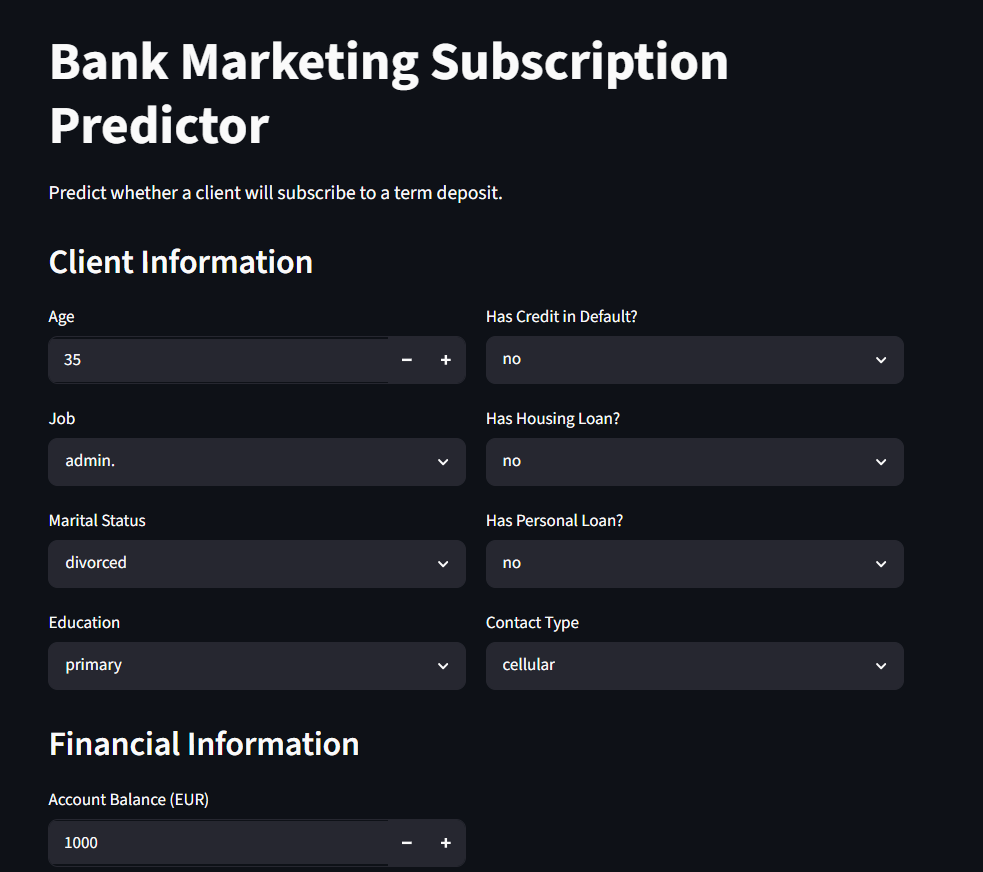
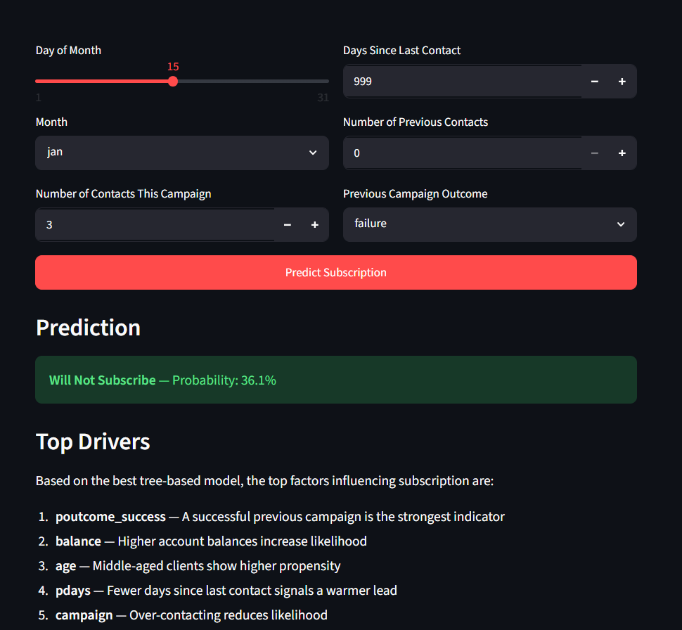

# Bank Marketing Subscription Prediction

Predict whether a client will subscribe to a term deposit using the UCI Bank Marketing dataset.

## Problem Statement

The goal is to build a classification model that predicts if a customer will subscribe to a term deposit (`y` = yes/no). This helps the bank focus marketing efforts on high-probability customers, reducing campaign costs and improving conversion rates.

## Dataset

- **Source:** UCI Bank Marketing dataset (`bank-full.csv`)
- **Rows:** 45,211 | **Columns:** 17 (10 categorical, 7 numerical)
- **Target:** `y` — binary (88.3% no / 11.7% yes) — imbalanced
- **Missing values:** No NaN, but `"unknown"` in 4 categorical columns (job, education, contact, poutcome)
- **Train/test split:** Stratified 80/20 (preserves class proportion)

## EDA Findings

- **Strongest predictor:** `duration` (r=0.40 with target) — but causes data leakage (known only after call ends), so it's dropped
- **Other influential features:** `poutcome_success`, `balance`, `age`, `day`, `pdays`, `campaign`, `housing`
- **Outliers present** in `balance`, `duration`, `campaign` — handled by tree-based models naturally
- **Class imbalance** (88.3/11.7) — F1 used as primary metric over accuracy

## Preprocessing

Built with `sklearn` `ColumnTransformer` + `Pipeline`:

- **Numeric:** `SimpleImputer(strategy=median)` → `StandardScaler`
- **Categorical:** `SimpleImputer(strategy=constant, fill_value="unknown")` → `OneHotEncoder(drop="first")`
- `duration` dropped due to data leakage

## Models Used

| # | Model | Type |
|---|-------|------|
| 1 | LogisticRegression (baseline) | Linear |
| 2 | DecisionTree | Tree-based |
| 3 | RandomForest + GridSearch | Ensemble (Bagging) |
| 4 | GradientBoosting + GridSearch | Ensemble (Boosting) |
| 5 | AdaBoost + GridSearch | Ensemble (Boosting) |
| 6 | **XGBoost + GridSearch** | Ensemble (Boosting) |

Hyperparameter tuning via `GridSearchCV` (5-fold, scoring=`f1`) for models 3–6.

## Results

| Model | CV F1 | Accuracy | Precision | Recall | F1 | ROC-AUC |
|---|---|---|---|---|---|---|
| LogisticRegression (baseline) | 0.5507 | 0.8460 | 0.4186 | 0.8138 | 0.5528 | 0.9078 |
| GradientBoosting + GridSearch | 0.5472 | 0.9077 | 0.6469 | 0.4641 | 0.5405 | 0.9301 |
| XGBoost + GridSearch | 0.5451 | 0.9091 | 0.6625 | 0.4546 | 0.5392 | 0.9333 |
| RandomForest + GridSearch | 0.4906 | 0.9045 | 0.6554 | 0.3866 | 0.4863 | 0.9272 |
| DecisionTree | 0.4743 | 0.8777 | 0.4783 | 0.4991 | 0.4884 | 0.7135 |
| AdaBoost + GridSearch | 0.4554 | 0.8987 | 0.6199 | 0.3469 | 0.4448 | 0.9073 |

**Final model:** XGBoost + GridSearch (best ROC-AUC: 0.9333, strong Precision: 0.6625)

## Feature Importance Interpretation

Top important features (after dropping `duration` due to data leakage):

1. **poutcome_success** — Customers with successful previous campaigns are far more likely to subscribe. Consistent with EDA.
2. **balance** — Higher account balances correlate with subscription propensity.
3. **age** — Middle-aged customers (30–50) show higher subscription rates.
4. **pdays** — Days since last contact; shorter gaps indicate warmer leads.
5. **campaign** — Fewer contacts → higher likelihood; over-contacting reduces success.

These features were also highlighted during EDA and remained important after model training. They provide actionable insights: focus on customers with prior success, healthy balances, and minimal recent contact.

## Overfitting Analysis

- **Decision Tree** showed weaker generalization (test ROC-AUC: 0.7135 vs ensemble >0.90), indicating overfitting due to lack of regularization.
- **Ensemble models** (Random Forest, Gradient Boosting, AdaBoost, XGBoost) achieved stable cross-validation performance and strong test metrics, demonstrating effective generalization through bagging/boosting.
- **Logistic Regression** provided a robust baseline with the highest recall (0.8138) and competitive F1.
- No severe overfitting was observed in the tuned ensemble models.

## Business Impact

- The model enables the bank to **prioritize high-probability customers**, reducing outreach costs while improving conversion rates.
- With ROC-AUC of 0.9333, the model effectively distinguishes subscribers from non-subscribers.
- Targeting the top 20% of predicted probabilities would capture the majority of actual subscribers, significantly lowering cost-per-acquisition.
- Key levers: focusing on customers with successful past campaigns, sufficient balance, and limited recent contact.

## Project Structure

```
├── data/             # bank-full.csv, train.csv, test.csv
├── notebooks/        # eda.ipynb
├── src/              # preprocessing.py, model.py, utils.py
├── output/           # model_comparison.csv
├── model.pkl         # Saved final pipeline (XGBoost)
├── requirements.txt
├── run.py
└── README.md
```

## Streamlit App

### Home Page



### Prediction Example



## Setup & Run

```bash
# Install dependencies
pip install -r requirements.txt

# Run full pipeline (training, evaluation, save model)
python run.py
```
